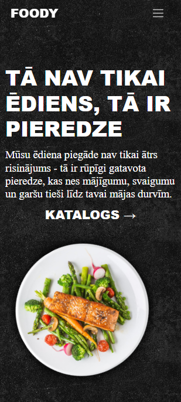
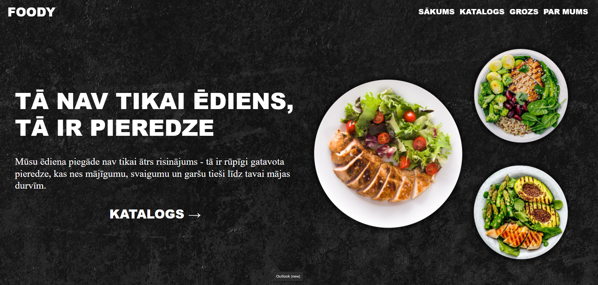
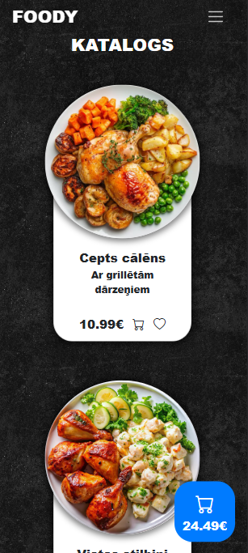
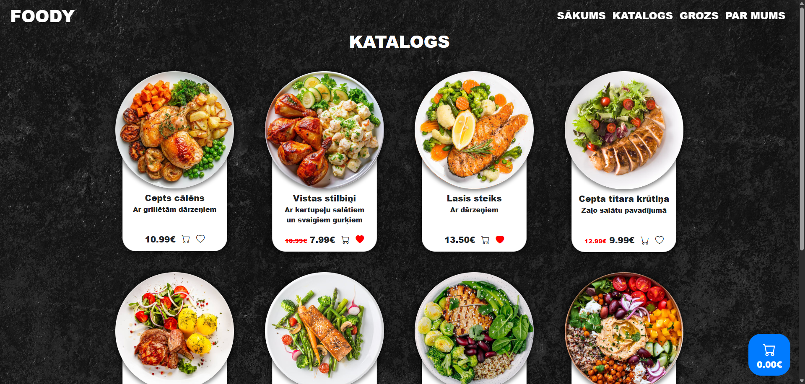
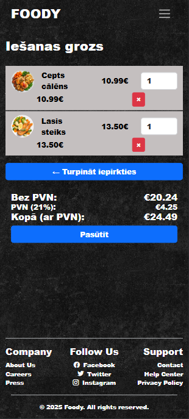
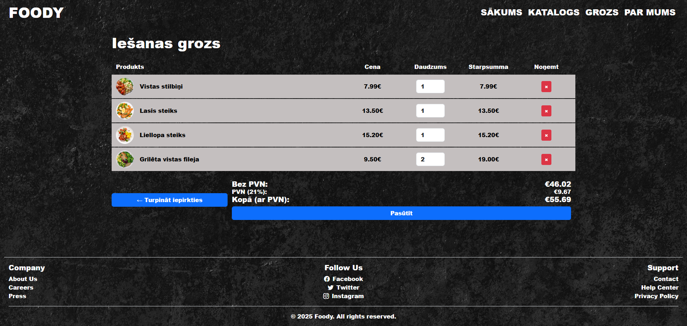
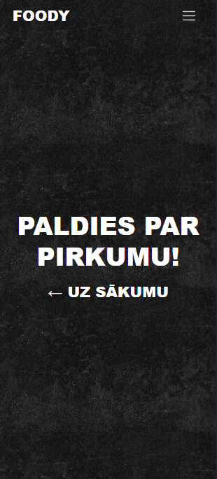
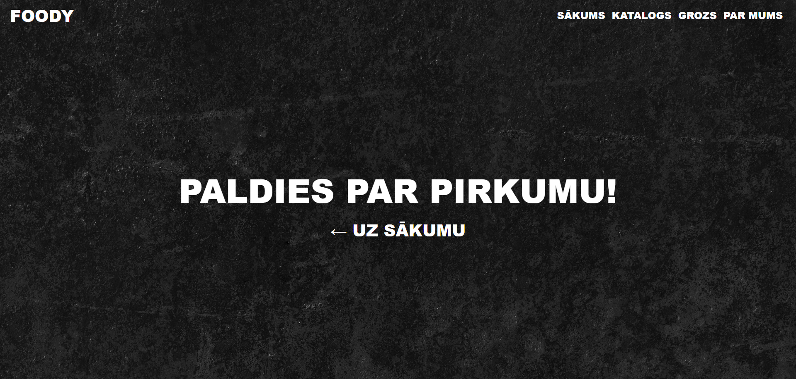

# 🍽️ Restaurant Food Delivery Website

This is a **school project** created using **HTML**, **CSS**, **JavaScript**, and **Bootstrap 5**.  
Unlike some of my other projects that use Django and databases, this one is **entirely static** — all state is handled on the client side using **localStorage**.

> 🗒️ **Note**: The website content is written in **Latvian**.

---

## 📱 Responsive Design

The website is fully responsive and looks great on **mobile**, **tablet**, and **desktop** devices thanks to Bootstrap's grid system and utility classes.

---

## 🧭 Pages Overview

### `index.html` – **Home**
- Displays an inspirational quote.
- Features a rotating visual display of dish plates.
- Includes a **"Catalog"** button that takes users to the catalog.

#### 📷 Screenshots

| Mobile View | Desktop View |
|-------------|--------------|
|  |  |

---

### `catalog.html` – **Dish Catalog**
- Shows a list of dishes as cards, each with:
  - An image
  - Short description
  - Price
  - Add to Cart button
  - Favorite (flag) button
- **Favorites and cart data are stored in `localStorage`**, allowing users to keep selections without a backend.

#### 📷 Screenshots

| Mobile View | Desktop View |
|-------------|--------------|
|  |  |

---

### `cart.html` – **Shopping Cart**
- Lists all selected dishes.
- Users can:
  - Change the quantity of each dish
  - View subtotal, tax, and total
  - Enter their address and card information
- Simulates a purchase — no payment gateway is integrated.

#### 📷 Screenshots

| Mobile View | Desktop View |
|-------------|--------------|
|  |  |

---

### `success.html` – **Purchase Confirmation**
- Displays a success message after a simulated purchase.

#### 📷 Screenshots

| Mobile View | Desktop View |
|-------------|--------------|
|  |  |

---

## ⚙️ How It Works

- The site uses **localStorage** to track:
  - Cart items
  - Favorite dishes
- No backend or database is involved.
- All form inputs (e.g., card number, address) are static and not submitted anywhere.
- Fully functional shopping cart logic is handled in **JavaScript**.

---

## 🛠️ Technologies Used

- HTML5
- CSS3
- JavaScript (vanilla)
- Bootstrap 5

---

## 📝 Notes

- No database or server-side logic is used.
- This is a front-end-only prototype of a food delivery website.
- A good foundation for learning how e-commerce logic can work in a static environment.